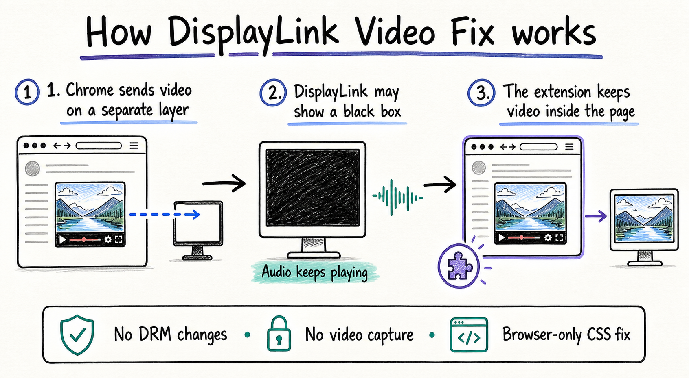

# DisplayLink Video Fix

Current version: **2.1.1**

A generic Chrome extension for streaming video that turns black while audio continues on DisplayLink monitors.

**Tested and verified:** Netflix and Prime Video. Other websites using standard HTML5 video may work, but they have not been tested yet.

The extension forces video through Chrome's page compositor instead of the direct hardware-overlay path that DisplayLink can present as black on macOS. It does not modify DRM, access video frames, or change Chrome's global graphics settings.

## How it works at a glance



## Install

1. Open `chrome://extensions`.
2. Enable **Developer mode**.
3. Click **Load unpacked**.
4. Select the `displaylink-video-fix` folder.
5. Pin **DisplayLink Video Fix**.

Because the fix is generic, Chrome will request access to HTTP and HTTPS pages. The extension only detects and styles `<video>` elements; it does not collect or transmit data.

## Use

1. Open any streaming-video page.
2. Reload the page once after installing or updating the extension.
3. Open the extension popup to confirm **Browser fix active**.
4. If needed, choose a monitor and click **Move & retry**.

## How the browser fix works

The extension runs at `document_start` and watches for HTML5 video elements in normal pages, nested frames, blob/about:blank player frames, and open or closed Shadow DOM. It adds an imperceptible no-op filter and fractional opacity:

```css
filter: sepia(0%);
opacity: 0.9999;
mix-blend-mode: normal;
```

This makes Chrome composite video with the webpage rather than placing it on a direct overlay plane. Playback and DRM licensing remain controlled by the website and browser.

## Technical details

- Manifest V3 extension with no build dependencies.
- Injects in the page's `MAIN` world at `document_start`.
- Covers top-level pages, nested frames, and origin-linked `about:blank` or blob player frames.
- Uses `MutationObserver` to handle players created after page load.
- Proxies `attachShadow()` so videos inside open or closed Shadow DOM receive the same fix.
- Runs diagnostics in an isolated content-script world and never accesses decoded video pixels.
- Makes no external network requests and stores only the last selected display ID.

Verified against Netflix and Prime Video in Chrome on macOS with DisplayLink. Support for other HTML5 video sites is intentionally generic but currently unverified.

## Is reconnecting required?

Usually, no. Reload the extension and video tab first. Reconnect the DisplayLink monitor only if the popup does not report **Browser fix active** after reloading. A Chrome extension cannot physically power-cycle a monitor.

DisplayLink documents the underlying macOS protected-content limitation at <https://support.displaylink.com/knowledgebase/articles/830301-content-protected-video-does-not-play-on-mac-while>.

## Development

No build step or dependencies are required.

```sh
npm test
npm run check
```

## Privacy

- Runs locally on HTTP and HTTPS pages so it can support any video website.
- Only inspects video playback state and applies compositor styles.
- Never reads credentials, cookies, account data, viewing history, or decoded frames.
- Stores only the last selected display ID.
